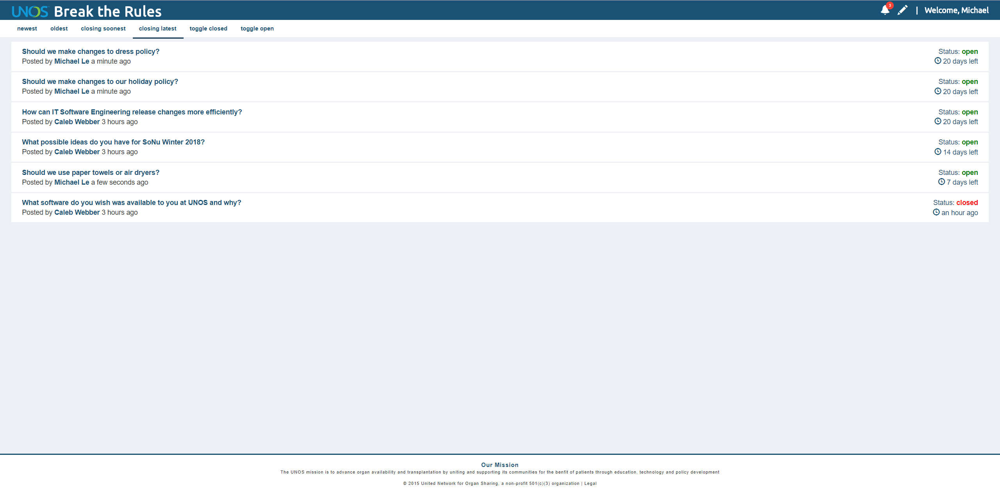
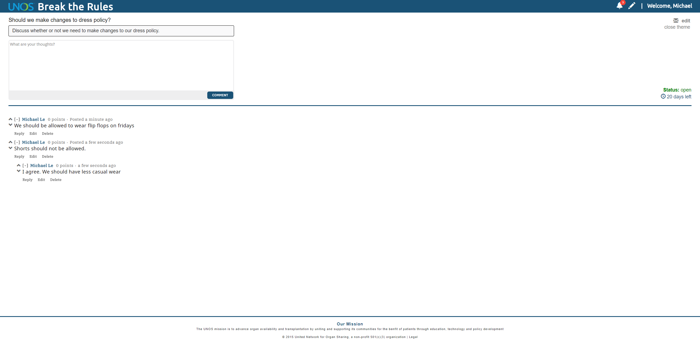
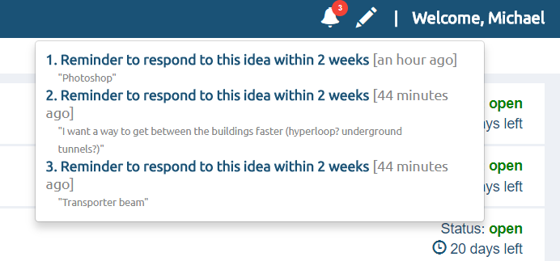

# BreakTheRules  

## Description
BreakTheRules (BTR) is a web application, intended for internal-use only, that is designed to foster policy change discussion between employees of a company. BTR is scalable so it can be used within a department or to connect multiple departments. It is also customizable and flexible in design to allow the owner of the application to shape the platform to fit their needs.

## Features  
• Asynchronous voting system to allow ideas and comments to be sorted by popularity in real-time  
• Notification system for owners and users to guarantee that all ideas wil be responded to and ensure accountability  
• Automated SQL jobs that run on a frequent basis  
• Angular Single-Page application for the client-side for a simple but strong user interface  
• Role-based authorization to allow different views and restrict actions to certain users utilizing Microsoft Active Directory  
• Windows-authentication for login (internal use)  

## Technologies  
• .NET Core 2.0  
• Entity Framework  
• Angular 6  
• Angular CLI  
• Node.js  
• NPM  

## User Interface

### Front Page

### Comment Section

### Theme Submission

### Notifications

